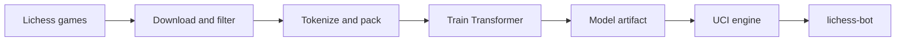

# Krasnal ♟️

[](https://deepwiki.com/KSI-ML-research/krasnal)
[](https://github.com/KSI-ML-research/krasnal/stargazers)
[](https://github.com/KSI-ML-research/krasnal/network)

Transformer-based chess engine.

## Project goal

Krasnal aims to be the most human-like chess engine: strong enough to play useful games, but
trained to choose moves that feel closer to human play than classical engine search.

## Architecture



## Setup

This project uses `uv` for dependency management.

```bash
uv sync
```

Optional local credentials can be configured by copying `.env.example` to `.env`.

## Common commands

Commands are defined in the local `justfile`.

```bash
just --list
just test
just lint
just format
```

The main pipeline commands are:

```bash
just download-games
just preprocess
just pretrain
```

## Training and artifacts

Training configuration lives in `config/`. Model sizes are defined under `config/model/`, while
runtime and training settings are split across `config/train/`, `config/preprocess.yaml`,
`config/download.yaml`, and `config/pretrain.yaml`.

Generated datasets, checkpoints, W&B runs, model artifacts, caches, and local bot files are not
committed to the repository.

## Lichess bot

The UCI engine can be run locally through `lichess-bot`.

```bash
make bot-setup
make bot-run MODEL_PATH=artifacts/path/to/model
```

See `docs/lichess_bot_local_setup.md` for details.
