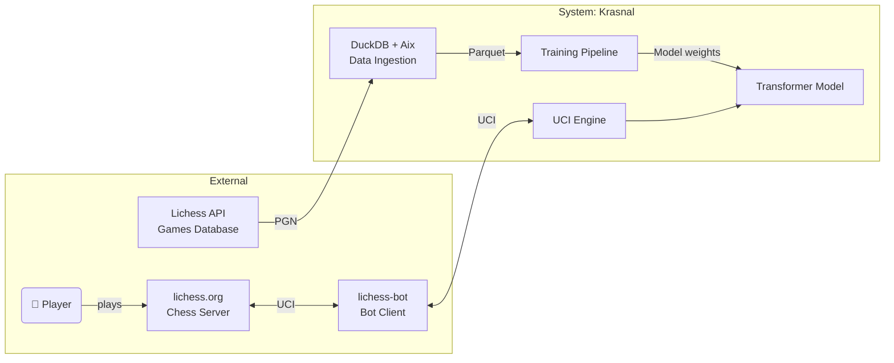
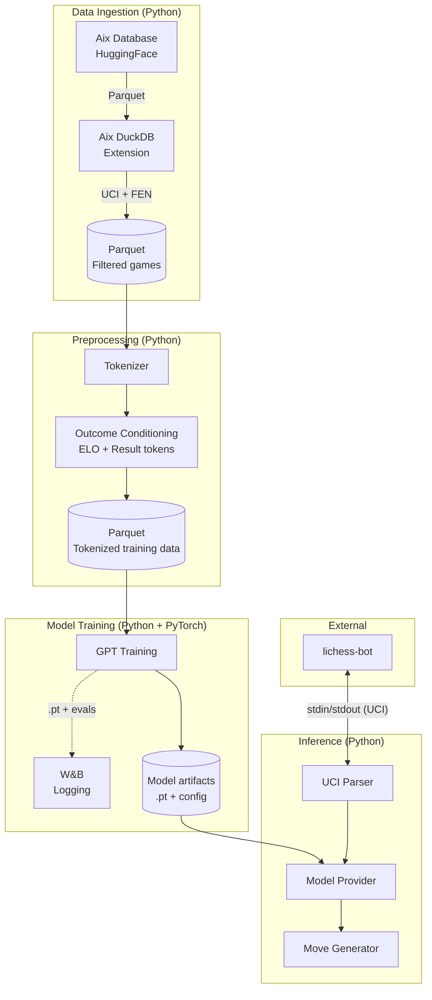

# Krasnal ♟️

**Wrocław-based chess engine powered by Transformer architecture.**

## 1. Project Goal

Krasnal is a Transformer-based chess engine. It aims to play strong, human-like chess — balancing the intuition of Maya Chess with the strength of Stockfish.

## 2. System Architecture

The architecture is documented using the [C4 model](https://c4model.com/).

### C4: Context Diagram

### C4: Container Diagram

---

## 3. Documentation

Detailed guides for developers and users:

-   [**Installation Guide**](docs/INSTALLATION.md) - How to set up the environment (Python, uv).
-   [**Training Pipeline**](docs/training_pipeline.md) - Download games, preprocess, and pretrain.
-   [**Contributing Guide**](docs/CONTRIBUTING.md) - Code standards, pre-commit hooks and development process.
-   [**Research Notes**](docs/RESEARCH.md) - Summary of tested architecture variants and experiments.
-   [**Outcome conditioning**](docs/outcome_conditioning.md) - Prefix with a win/loss token so the model can be steered toward playing for White or Black.
-   [**Chain-of-thought (WIP)**](docs/cot.md) - CoT training notes.
-   [**Weights & Biases**](docs/wandb.md) - Experiment logging.
-   [**Lichess bot (local)**](docs/lichess_bot_local_setup.md) - Run the bot from your machine.
-   [**Bot implementation plan**](docs/bot_implementation_plan.md) - Lichess integration architecture.

## 4. Configuration Layout

-   Hydra configs for training and generation live in `config/`.
-   Lichess bot template config lives at `config/config.yml.example`.
-   Existing `just` command usage remains the same.
