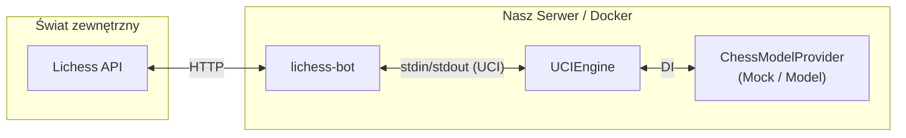

# Plan Wdrożenia Bota Krasnal na Lichess

Podsumowanie i plan implementacji bota szachowego "Krasnal" na platformie Lichess.

## Słownik

UCI - Universal Chess Interface - standard do komunikacji dzięki któremu silnik (nasz model) może grać gry.

## 1. Architektura

- **Platforma Lichess**: Serwer szachowy komunikujący się z naszym botem przez oficjalne Bot API.
- **`lichess-bot` (Klient open-source)**: Lichess-bot odpowiada za całą komunikację z lichess. Jedyne co musimy zrobić my, to zintegrować lichess-bot z naszymi modelami i postawić to zintegrowane coś, żeby było dostępne publicznie dla lichess.
- **Silnik (Krasnal UCI)**: Nasz kod w Pythonie (np. `uci_engine.py`). Jest to program, który `lichess-bot` uruchamia jako "silnik UCI". Komunikuje się z lichess-bot wyłącznie przez standardowe wejście/wyjście (stdin/stdout) operując na protokole UCI (Universal Chess Interface).
- **Dependency Injection**: Aby oddzielić pracę inżynierską od modelu, logikę decyzyjną bota ukrywamy za interfejsem (w Pythonie: `Protocol` z biblioteki `typing`).

## 2. Plan Implementacji: Moduł Silnika (Engine)

1. **Definicja Interfejsu (Protokołu) za którym będą stały prawdziwe modele**
   - Stworzenie pliku z interfejsem (np. `ChessModelProvider`).
   - Kontrakt wymaga implementacji funkcji, np. `get_best_move(uci_moves: str) -> str`.
2. **Napisanie silnika komunikującego lichess-bot z naszym modelem (`UCIEngine`)**
   - Utworzenie klasy silnika, która w konstruktorze przyjmuje wstrzykniętą implementację `ChessModelProvider` (DI).
   - Klasa nasłuchuje nieskończoną pętlą na stdin (parsując podstawowe komendy UCI jak `isready`, `position ...`, `go ...`) i deleguje wyliczenie ruchu do providera. Odpowiedź (np. `bestmove e7e5`) wysyła na stdout.
3. **Implementacja Mocka (do testów i jako jakiś POC)**
   - Napisanie implementacji np. `RandomMockProvider`, która implementuje interfejs i zwraca po prostu legalny (choćby wylosowany z listy) ruch w notacji UCI. Pozwoli to na wczesne testy integracji silnika z `lichess-bot` całkowicie bez udziału PyTorcha.
4. **Punkt Wejścia (Entrypoint - Composition Root)**
   - Napisanie skryptu startowego, który na podstawie np. zmiennej środowiskowej (np. `ENGINE_ENV=mock` lub `ENGINE_ENV=pytorch`) decyduje, jaką implementację wstrzyknąć do konstruktora klasy `UCIEngine`.

## 3. Plan Implementacji: ML i Integracja z Modelem

TODO: trzeba zrobić klasę analogicznę do mocka powyżej, która wykorzystuje jednak prawdziwy model. Dopóki model będzie mały, to może spokojnie siedzieć w RAMie tego samego serwera, na którym mamy odpalony lichess-bot. Jakby model zaczął być za duży, to trzeba go będzie wynieść na osobną maszynę, a serwer z lichess-bot będzie się komunikował po api z serwerem z modelem.

## 4. Plan: Konfiguracja Lichess i Konteneryzacja

1. **Konto i Bot API Token**
   - Utworzenie konta na Lichess dla bota.
   - Wygenerowanie tokena z uprawnieniami `Play as a bot` i "upgrade" konta do statusu BOT. Cośtam trzeba poklikać na stronie i strzelić na jakiś endpoint. **Ważne, że na tym koncie nie można zagrać żadnej partii jako człowiek!**
2. **Pakowanie Aplikacji (Docker)**
   - Stworzenie `Dockerfile`, który:
     - Bazuje na obrazie z Pythonem.
     - Instaluje wymagane biblioteki (`uv`, `torch`, `polars` itp.).
     - Pobiera submoduł repozytorium `lichess-bot`.
     - Kopiuje kod i wagi modelu (`.pt`).
     - Konfiguruje `lichess-bot` tak, aby jako silnika używał komendy odpalającej Wasz "Punkt Wejścia" (np. `python uci_engine.py`).

## 5. Plan Wdrożenia (Deployment & CI/CD)

Fajnie jak nam się uda ograć to, że wdrożenie musi unikać przerywania toczących się partii.

1. **Hosting**
   - Do wyboru: maszyna na uczelni, albo coś w chmurze - to decyzji później.
2. **Automatyzacja (GitHub Actions)**
   - Nowe wagi modelu lub zmiany w kodzie po wpadnięciu na maina triggerują workflow z budowaniem nowego obrazu Dockerowego i podmienianiem tego, co obecnie chodzi na serwerze.
3. **Graceful Wait (Zero-Downtime Deployment)**
   - **Uproszczenie dzięki lichess-bot**: Nie musimy ręcznie odpytywać API Lichess. `lichess-bot` posiada wbudowaną opcję `quit_after_all_games_finish: true` w pliku `config.yml`.
   - Kiedy `lichess-bot` otrzyma sygnał `SIGINT` (Ctrl+C), przestaje przyjmować nowe wyzwania, kończy trwające partie i dopiero wtedy się wyłącza.
   - W `Dockerfile` wystarczy dodać instrukcję `STOPSIGNAL SIGINT`, aby komenda `docker stop` (używana przez pipeline wdrożeniowy) wysyłała odpowiedni sygnał. Docker poczeka na zakończenie procesu (warto ustawić odpowiednio długi `--time` przy `docker stop`, np. `docker stop -t 3600 <container>`, aby zapobiec twardemu ubiciu kontenera po domyślnych 10 sekundach).

## 6. Co później

Podejście oparte na Dependency Injection perfekcyjnie przygotowuje projekt na przyszłe skalowanie:
- Jeśli model przestanie mieścić się w RAMie serwera utrzymującego połączenie z Lichess, system można podzielić.
- Tworzymy nową implementację silnika np. `RemoteApiProvider` implementujący `ChessModelProvider`, który zamiast ładować PyTorcha do pamięci, robi strzał do osobnego serwera (np. `FastAPI` z dużym GPU wynajętego na godziny na chmurze/wydziale).
- `lichess-bot` i interfejs UCI mogą wtedy działać na najtańszym możliwym serwerze z minimalną ilością RAM-u, w ogóle nie ładując PyTorcha.
